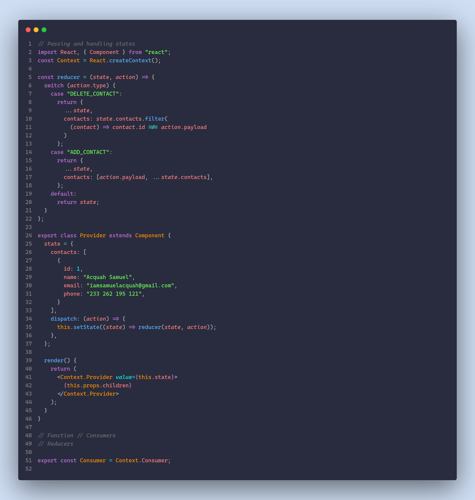

## Blonder Theme for VS Code

 

 

 

  
  
  
  

 
 

## Installation via VS Code 
1. Open Extensions sidebar panel in VS Code. View → Extensions
2. Search for Blonder
3. Click Install to install it
4. Click Reload to reload the editor
5. Code > Preferences > Color Theme > Blonder
6. 🌟 Enjoy and [Rate five-stars](https://marketplace.visualstudio.com/items?itemName=acquahsamuel.blonder&ssr=false#overview)

 
### Additional Resources 
Read the [VSC Extension Quickstart Guide](https://github.com/acquahsamuel/blonder-theme/blob/master/vsc-extension-quickstart.md)
